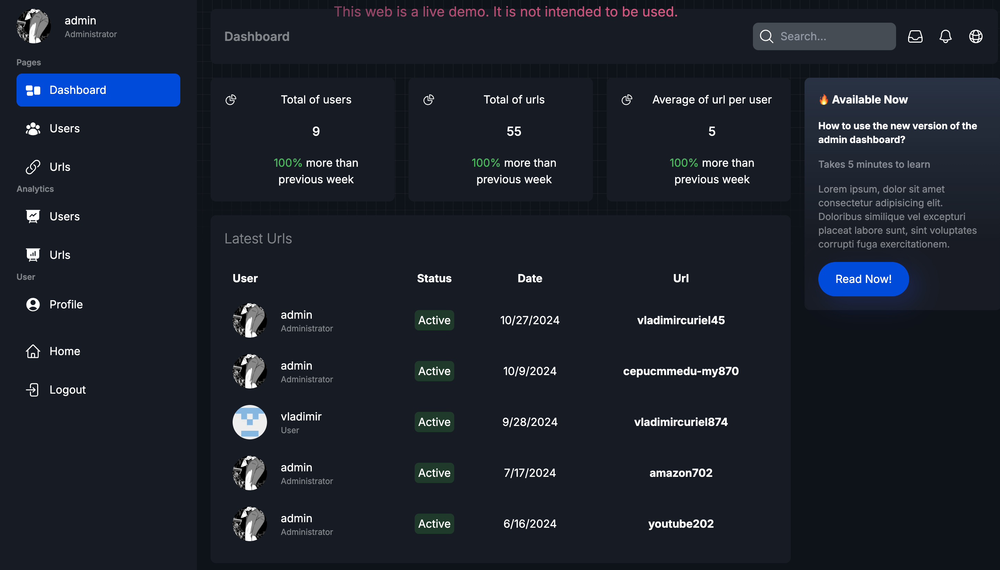

# Linkloom Url Shortener

[Linkloom](https://linkloom.live/) es una aplicación web para acortar urls, generar códigos QR, capturar estadísticas y demás. Esta aplicación cuenta con dos versiones, una en Java y otra en NextJS.

La versión de Java fue la primera versión de la aplicación, la cual fue creada con el framework Javalin, utilizando MongoDB como motor de base de datos. La versión de NextJS es la segunda versión de la aplicación, la cual fue creada con NextJS, utilizando MongoDB como motor de base de datos.

Para ver directamente la versión el linea de la aplicación en NextJS, puedes hacer clic [aquí](https://linkloom.live/). O ver el apartado de la versión de [NextJS](#versión-de-nextjs).

## Versión de Java

La primera versión de esta aplicación web la realicé en [Java](https://dev.java/), utilizando el framework [Javalin](https://javalin.io/). Para la interfaz gráfica se utilizó HTML, CSS y JavaScript, con [TailwindCSS](https://tailwindcss.com) para el diseño. Como motor de base de datos se utilizó [MongoDB](https://www.mongodb.com/) utilizando [hibernate](https://hibernate.org/orm/) como ORM.

Esta aplicación permite que los usuarios autentificados como no, puedan acortar urls, de la cuales se generan códigos QR con [QRCodeJs](https://github.com/davidshimjs/qrcodejs), se capturan estadísticas de las visitas, se realizan gráficos con [ChartJS](https://www.chartjs.org) de diversas informaciones del navegador, sistema operativo, etc. Se muestra un preview de la url acortadas utilizando [LinkPreview](https://www.linkpreview.net/). Se hace uso de sesiones para mantener la información del usuario autentificado, los cuales pueden ver todas las urls acortadas, mientras que los no autentificados solo pueden ver las urls acortadas mientras dure la sesión.

Para manejar la información de los usuarios y las urls acortadas, se utiliza una base de datos NoSQL [MongoDB](https://www.mongodb.com/). Los usuarios cuentan con roles que les permiten realizar ciertas acciones, como administrar las urls acortadas, ver las estadísticas, etc. Asi mismo, se utilizan Service Workers nativos de JavaScript para manejar la cache de la aplicación y poder ver las urls offline.

### Demo de la aplicación

<iframe width='100%' height="500" src="https://www.youtube.com/embed/9UcXEd4CA6c?si=PB2qrVjmSlLCCLI9" title="YouTube video player" frameborder="0" allow="accelerometer; autoplay; clipboard-write; encrypted-media; gyroscope; picture-in-picture; web-share" referrerpolicy="strict-origin-when-cross-origin" allowfullscreen></iframe>

### Arquitectura de la aplicación

La aplicación está creada con el patrón de diseño MVC (Modelo-Vista-Controlador), donde el modelo es la base de datos, la vista es la interfaz gráfica y el controlador es el servidor que maneja las peticiones del cliente.

<!-- image -->

### Listado de tecnologías utilizadas

- [Java](https://dev.java/)
- [Javalin](https://javalin.io/)
- [HTML](https://developer.mozilla.org/es/docs/Web/HTML)
- [CSS](https://developer.mozilla.org/es/docs/Web/CSS)
- [JavaScript](https://developer.mozilla.org/es/docs/Web/JavaScript)
- [TailwindCSS](https://tailwindcss.com)
- [MongoDB](https://www.mongodb.com/)
- [Hibernate](https://hibernate.org/orm/)
- [QRCodeJs](https://github.com/davidshimjs/qrcodejs)

### Mejoras de la aplicación

- Mejorar la interfaz gráfica
- Mejorar la seguridad de la aplicación
- Mejorar la velocidad de carga de la aplicación

### Notas

Esta versión de la aplicación no está disponible en línea, pero se puede clonar el repositorio de Github y ejecutarlo localmente.

### Repositorio de GitHub

::github{repo="nightmareVCO/urlShortenerJava"}

## Versión de NextJS

La segunda versión de esta aplicación web la realicé en [NextJS](https://nextjs.org/docs). Para la interfaz gráfica se utilizó [React](https://es.reactjs.org/), con [TailwindCSS](https://tailwindcss.com) para el diseño. Como motor de base de datos se utilizó [MongoDB](https://www.mongodb.com/) utilizando [mongoose](https://mongoosejs.com/) como ORM y ahora cuenta con un sistema de autenticación con [NextAuth](https://next-auth.js.org/).

Esta aplicación hereda casi toda la funcionalidad de la versión en Java, pero con una interfaz gráfica más moderna y rápida. Se utilizan hooks de React para manejar el estado de la aplicación, se utilizan contextos para manejar la información del usuario autentificado, se utilizan rutas privadas para proteger las rutas de la aplicación, se utilizan rutas dinámicas para mostrar la información de las urls acortadas, se utilizan rutas estáticas para mostrar la información de las urls acortadas en la página principal.

## Dashboard de la aplicación en NextJS

El cambio más significativo de la versión en NextJS es el dashboard de la aplicación, donde se muestra la información de las urls acortadas, las estadísticas de las visitas, los gráficos de las visitas, etc. Para los graficos se utilizó [ReactCharts](https://recharts.org/en-US/).

Se puede acceder a la versión en línea de la aplicación en NextJS haciendo clic [aquí](https://linkloom.live/). Para tener privilegios de administrador, se puede iniciar sesión con las siguientes credenciales: 

- Correo: `admin@admin.com`
- Contraseña: `admin`

## Listado de tecnologías utilizadas

- [NextJS](https://nextjs.org/docs)
- [React](https://es.reactjs.org/)
- [TailwindCSS](https://tailwindcss.com)
- [MongoDB](https://www.mongodb.com/)
- [Mongoose](https://mongoosejs.com/)
- [NextAuth](https://next-auth.js.org/)
- [ReactCharts](https://recharts.org/en-US/)

### Mejoras de la aplicación

- Reintegrar la funcionalidad de los Service Workers
- Agregar más métodos de autenticación, como Google, Facebook, etc.
- Agregar más gráficos de las estadísticas de las visitas

### Repositorio de GitHub

::github{repo="nightmareVCO/urlShortener-nextjs"}